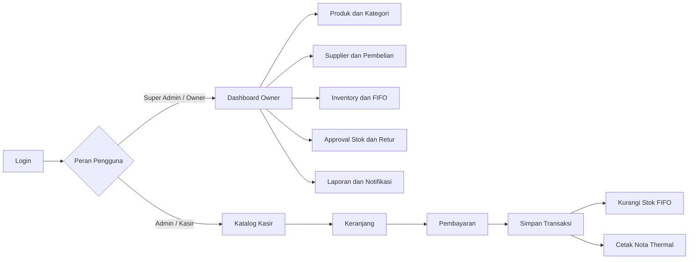
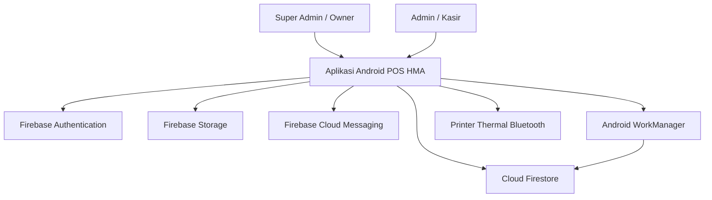

div align="center">

# POS HMA Motor

### Aplikasi Point of Sales Berbasis Android untuk Bengkel HMA Motor

Aplikasi kasir dan pengelolaan operasional bengkel yang membantu proses transaksi, pencatatan barang dan jasa, pengendalian stok, pembelian, retur, pencetakan nota, serta penyajian laporan usaha.

[](https://kotlinlang.org/)
[](https://developer.android.com/)
[](https://firebase.google.com/)
[](#)
[](#)

</div>

---

## Tentang Proyek

**POS HMA Motor** merupakan aplikasi Point of Sales berbasis Android yang dikembangkan untuk membantu digitalisasi proses bisnis Bengkel HMA Motor.

Aplikasi ini menyediakan dua jenis akses pengguna:

- **Super Admin/Owner**, untuk mengelola produk, kategori, supplier, persediaan, permintaan penyesuaian stok, notifikasi, dan laporan usaha.
- **Admin/Kasir**, untuk melayani transaksi barang maupun jasa, mengelola keranjang, menerima pembayaran, mencetak nota, melihat laporan kasir, dan mengajukan retur.

Proyek ini dikembangkan menggunakan **Kotlin** dengan antarmuka utama berbasis **XML**, serta memanfaatkan Firebase sebagai layanan autentikasi, basis data, penyimpanan, dan notifikasi.

## Tujuan Pengembangan

Aplikasi ini dikembangkan untuk:

- mempercepat proses transaksi penjualan barang dan jasa;
- mengurangi kesalahan pencatatan transaksi dan persediaan;
- membantu pemilik memantau omzet, laba, serta pergerakan stok;
- mencatat pembelian dan penerimaan stok secara lebih terstruktur;
- menyediakan riwayat transaksi dan laporan berdasarkan periode;
- mendukung pencetakan nota melalui printer thermal Bluetooth;
- menerapkan pembagian hak akses berdasarkan peran pengguna.

## Fitur Utama

### Super Admin / Owner

| Fitur | Deskripsi |
|---|---|
| Dashboard | Menampilkan ringkasan usaha, pendapatan, laba, dan visualisasi penjualan. |
| Manajemen Produk | Menambah, mengubah, melihat, dan menghapus data barang maupun jasa. |
| Manajemen Kategori | Mengatur kategori produk yang digunakan pada katalog. |
| Manajemen Supplier | Mengelola data pemasok barang. |
| Inventory | Memantau jumlah stok dan riwayat pergerakan persediaan. |
| Pembelian dan Penerimaan | Mencatat pembelian serta penerimaan stok berdasarkan tanggal jatuh tempo. |
| FIFO | Mengurangi stok berdasarkan batch yang diterima lebih dahulu. |
| Penyesuaian Stok | Menyetujui atau menolak permintaan perubahan stok dari kasir. |
| Retur | Meninjau dan memproses permintaan retur transaksi. |
| Laporan | Melihat laporan penjualan berdasarkan rentang tanggal. |
| Notifikasi | Menerima informasi penyesuaian stok, jatuh tempo pembelian, dan ringkasan bulanan. |

### Admin / Kasir

| Fitur | Deskripsi |
|---|---|
| Katalog | Menampilkan barang dan jasa yang tersedia serta pencarian berdasarkan nama atau kategori. |
| Keranjang | Menambah, mengurangi, dan menghapus item transaksi. |
| Pembayaran | Menghitung total transaksi, uang tunai, dan kembalian. |
| Transaksi Barang dan Jasa | Mendukung penjualan produk dengan stok serta jasa tanpa stok. |
| Deskripsi Jasa | Menambahkan keterangan pekerjaan atau layanan pada transaksi. |
| Nota | Menampilkan dan mencetak bukti transaksi. |
| Printer Thermal | Mencetak nota menggunakan koneksi Bluetooth. |
| Laporan Kasir | Melihat riwayat dan ringkasan transaksi kasir. |
| Retur | Mengajukan retur berdasarkan transaksi yang telah dilakukan. |
| Permintaan Stok | Mengajukan penyesuaian stok untuk ditinjau oleh owner. |

## Alur Aplikasi



## Teknologi yang Digunakan

| Teknologi | Penggunaan |
|---|---|
| Kotlin | Bahasa utama pengembangan aplikasi Android. |
| XML Layout | Pembuatan antarmuka pengguna. |
| Android ViewBinding | Mengakses komponen antarmuka secara aman. |
| Android Data Binding | Menghubungkan data dengan komponen tampilan. |
| Fragment Navigation | Navigasi antarhalaman aplikasi. |
| RecyclerView | Menampilkan katalog, transaksi, laporan, dan daftar data. |
| Firebase Authentication | Autentikasi pengguna menggunakan email dan password. |
| Cloud Firestore | Penyimpanan data pengguna, produk, stok, transaksi, dan laporan. |
| Firebase Storage | Penyimpanan gambar produk dan berkas pendukung. |
| Firebase Cloud Messaging | Dukungan pengiriman notifikasi. |
| WorkManager | Menjalankan pekerjaan terjadwal di latar belakang. |
| Coil | Memuat dan menampilkan gambar pada aplikasi. |
| MPAndroidChart | Menampilkan grafik pada dashboard dan laporan. |
| Bluetooth | Menghubungkan aplikasi dengan printer thermal. |
| Gradle Kotlin DSL | Konfigurasi build proyek. |

## Arsitektur Sistem



Secara umum, proyek dipisahkan menjadi beberapa lapisan:

```text
app/src/main/java/com/example/pos_hma/
├── adapter/       # Adapter RecyclerView
├── data/          # Model data aplikasi
├── ui/            # Activity dan Fragment
│   ├── login/
│   ├── splash/
│   └── role/
│       ├── admin/
│       └── super_admin/
├── utils/         # Helper dan utilitas
├── viewmodel/     # Pengelolaan state dan logika tampilan
└── worker/        # Pemrosesan stok terjadwal
```

## Struktur Data Firestore

Beberapa collection utama yang digunakan dalam aplikasi:

| Collection | Fungsi |
|---|---|
| `users` | Menyimpan profil pengguna dan perannya. |
| `products` | Menyimpan data barang dan jasa. |
| `categories` | Menyimpan kategori produk. |
| `suppliers` | Menyimpan data supplier. |
| `purchases` | Menyimpan transaksi pembelian barang. |
| `stock_batches` | Menyimpan batch stok untuk perhitungan FIFO. |
| `inventory_movements` | Menyimpan riwayat perubahan persediaan. |
| `stock_adjust_requests` | Menyimpan permintaan penyesuaian stok. |
| `sales` | Menyimpan transaksi penjualan dan item transaksi. |
| `notifications` | Menyimpan notifikasi untuk pengguna. |
| `return_requests` | Menyimpan permintaan retur transaksi. |

> Nama field dan struktur dokumen dapat berkembang mengikuti kebutuhan aplikasi.

## Persyaratan Sistem

Sebelum menjalankan proyek, siapkan:

- Android Studio versi terbaru;
- JDK 11;
- Android SDK 35;
- perangkat atau emulator minimal Android 7.0 / API 24;
- akun dan proyek Firebase;
- koneksi internet;
- printer thermal Bluetooth untuk menguji fitur pencetakan.

## Instalasi dan Menjalankan Proyek

### 1. Clone Repository

```bash
git clone https://github.com/LoPoBidau/Point-of-sales-HMA.git
cd Point-of-sales-HMA
```

### 2. Buka di Android Studio

Buka folder proyek menggunakan Android Studio, kemudian tunggu proses **Gradle Sync** selesai.

### 3. Konfigurasi Firebase

Buat proyek baru melalui Firebase Console, kemudian aktifkan layanan berikut:

1. Authentication dengan metode **Email/Password**;
2. Cloud Firestore;
3. Firebase Storage;
4. Firebase Cloud Messaging.

Unduh file konfigurasi Firebase dan letakkan pada:

```text
app/google-services.json
```

> Gunakan konfigurasi Firebase milik sendiri. Jangan menggunakan konfigurasi produksi milik pihak lain.

### 4. Deploy Firestore Rules dan Indexes

Pastikan Firebase CLI telah terpasang, kemudian jalankan:

```bash
firebase login
firebase use --add
firebase deploy --only firestore:rules,firestore:indexes
```

### 5. Jalankan Aplikasi

Pilih perangkat Android atau emulator, kemudian tekan tombol **Run** pada Android Studio.

Proyek juga dapat dibangun melalui terminal:

#### Windows

```bash
gradlew.bat assembleDebug
```

#### Linux atau macOS

```bash
./gradlew assembleDebug
```

Hasil APK debug berada pada:

```text
app/build/outputs/apk/debug/app-debug.apk
```

## Konfigurasi Akun dan Peran

Aplikasi menggunakan pembagian akses berdasarkan field `role` pada dokumen pengguna.

Contoh struktur dokumen pada collection `users`:

```json
{
  "uid": "firebase-user-id",
  "name": "Nama Pengguna",
  "email": "user@example.com",
  "role": "admin"
}
```

Nilai peran yang digunakan:

```text
admin
super_admin
```

Pastikan UID dokumen pengguna sesuai dengan UID yang dihasilkan Firebase Authentication.

## Alur Persediaan FIFO

Sistem persediaan menerapkan metode **First In, First Out**:

1. pembelian atau penerimaan stok dibuat sebagai batch;
2. setiap batch menyimpan jumlah awal, sisa stok, harga modal, dan tanggal penerimaan;
3. saat transaksi penjualan terjadi, stok dikurangi dari batch paling lama;
4. harga modal barang pada transaksi diambil dari batch yang digunakan;
5. batch ditandai selesai ketika sisa stok mencapai nol;
6. riwayat perubahan disimpan pada inventory movement.

Metode ini membantu menghasilkan perhitungan nilai persediaan dan laba yang lebih akurat.

## Izin Android

Aplikasi menggunakan beberapa izin perangkat untuk mendukung fitur:

- akses internet dan status jaringan;
- Bluetooth dan Bluetooth Scan/Connect;
- kamera;
- notifikasi;
- akses Wi-Fi;
- FileProvider untuk membagikan atau membuka berkas nota.

Pada Android 12 atau lebih baru, pengguna perlu memberikan izin Bluetooth. Pada Android 13 atau lebih baru, pengguna juga perlu memberikan izin notifikasi.

## Pengujian

Pengujian dapat dilakukan melalui:

```bash
./gradlew test
```

Untuk pengujian instrumentasi Android:

```bash
./gradlew connectedAndroidTest
```

Beberapa skenario penting yang perlu diuji:

- login dan pengalihan halaman berdasarkan peran;
- transaksi barang dengan stok mencukupi;
- transaksi jasa tanpa pengurangan stok;
- perhitungan total, tunai, dan kembalian;
- pengurangan stok menggunakan FIFO;
- persetujuan dan penolakan penyesuaian stok;
- penerimaan stok terjadwal;
- pencetakan nota melalui Bluetooth;
- filter laporan berdasarkan periode;
- pengajuan dan persetujuan retur.

## Roadmap

- [x] Autentikasi dan pembagian peran
- [x] Katalog barang dan jasa
- [x] Keranjang dan pembayaran
- [x] Penyimpanan transaksi
- [x] Manajemen produk dan kategori
- [x] Manajemen supplier dan pembelian
- [x] Inventory movement
- [x] Pengelolaan batch stok FIFO
- [x] Penyesuaian stok dengan approval
- [x] Laporan kasir dan owner
- [x] Retur transaksi
- [x] Pencetakan nota thermal
- [x] Notifikasi dan pekerjaan terjadwal
- [ ] Menambah dokumentasi screenshot aplikasi
- [ ] Menambah automated UI testing
- [ ] Menambah pipeline CI/CD
- [ ] Menyediakan release APK pada GitHub Releases

## Keamanan

- Jangan menyimpan password atau kredensial admin di dalam source code.
- Gunakan Firebase Security Rules untuk membatasi akses berdasarkan pengguna dan peran.
- Ganti file `google-services.json` dengan konfigurasi Firebase milik sendiri.
- Jangan mengunggah service account key atau private key ke repository.
- Tinjau kembali aturan Firestore dan Storage sebelum aplikasi digunakan pada lingkungan produksi.

## Kontribusi

Kontribusi, saran, dan laporan masalah dapat disampaikan melalui GitHub Issues.

Langkah kontribusi:

1. Fork repository ini.
2. Buat branch fitur baru.

   ```bash
   git checkout -b feature/nama-fitur
   ```

3. Commit perubahan.

   ```bash
   git commit -m "feat: menambahkan nama fitur"
   ```

4. Push branch ke repository.

   ```bash
   git push origin feature/nama-fitur
   ```

5. Buat Pull Request.

## Pengembang

**Lilo Puji Pratama**

Mahasiswa Teknik Informatika — Politeknik Negeri Samarinda

- GitHub: [LoPoBidau](https://github.com/LoPoBidau)
- Repository: [Point-of-sales-HMA](https://github.com/LoPoBidau/Point-of-sales-HMA)

## Lisensi

Proyek ini dikembangkan untuk keperluan akademik dan portofolio.

Repository ini belum menyertakan lisensi open-source. Penggunaan, penyalinan, distribusi, atau modifikasi proyek di luar keperluan pembelajaran harus memperoleh izin dari pengembang.

---

<div align="center">

Dikembangkan dengan Kotlin dan Firebase untuk membantu digitalisasi operasional Bengkel HMA Motor.

</div>
